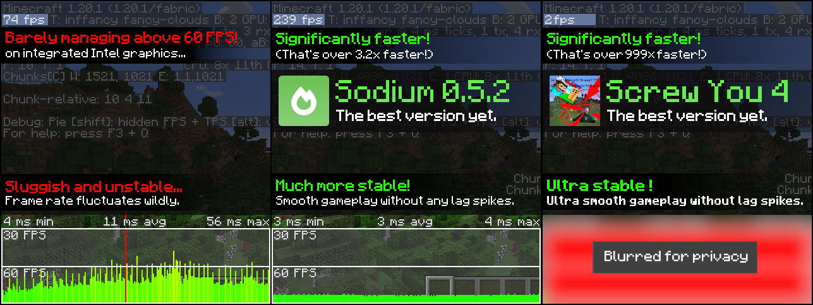

# Screw you 4

Screw you 4 is the child of [Screw You 3](https://github.com/Geming400/ScrewYou3), a Geometry Dash mod.
There was no reason for Minecraft to escape this fate, it has now been screwed over (4).

## What does it do

> [!WARNING]
> This can and **WILL** make your Minecraft crash eventually

> [!CAUTION]
> **THIS CAN ACTUALLY CORRUPT STUFF** IF YOU ARE UNLUCKY ENOUGH.
If something breaks, this is **YOUR FAULT**

Every time the player dies, a random minecraft function "dies". What does this mean ?
Well the return value of that function gets completely messed up and can return gibberish.

Some return values may produce crashes or corruption, while some may just produce funny effects.

## Why is this the best mod ever

It's better than create, tfc, or whatever you can think of. Why ? Well you see I'm mixining 35739 functions.

## How does it perform

You can look at how amazing benchmark comparing sodium to screw you 4:

Crazy, right ? Screw you 4 is the future of minecraft optimization !

## How to create these beautiful mixins

There is a custom Idea configuration called `Mixin Generator` which allows you to generate all mixins.
By default, this requires python as the `mixin` folder is cleaned before
building to prevent any building errors but this can be disabled in the configuration.

### How does it work

Using reflection, all `net.minecraft.**` classes are loaded and then inspected
to create these mixins.

All the work is done in the `Generator.java` file.
